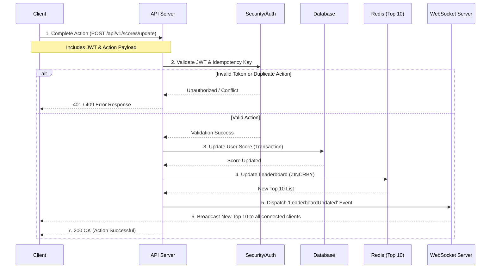

# Score Board Module Specification

## 1. Module Overview
The Score Board Module manages user scores and provides a real-time leaderboard of the top 10 users. Its primary goal is to ensure data integrity by preventing unauthorized score increments while maintaining high responsiveness for live updates.

## 2. Execution Flow Diagram
The following sequence diagram illustrates the flow of execution when a user completes an action that updates their score.



## 3. Software Requirements Fulfilled

1. **Website with Top 10 Scoreboard:** Addressed via the `/api/v1/scores/top` endpoint and Redis caching.
2. **Live Updates:** Achieved using WebSockets to push changes to clients immediately upon a score change.
3. **User Action Increments Score:** Handled by the `/api/v1/scores/update` endpoint.
4. **API Dispatch on Action Completion:** The client is responsible for calling the API once the action completes on the frontend.
5. **Prevent Malicious Updates:** Implemented via JWT authentication, rate limiting, and server-side action validation.

## 4. API Documentation

### Update Score
* **Endpoint:** `POST /api/v1/scores/update`
* **Description:** Dispatched by the client upon completion of an action to increment the user's score.
* **Headers:**
  * `Authorization`: `Bearer <JWT_TOKEN>`
  * `X-Idempotency-Key`: `UUID` (To prevent duplicate requests/replay attacks)
* **Payload:**
  ```json
  {
    "actionId": "string (identifier for the action performed)",
    "timestamp": "ISO-8601 UTC timestamp"
  }
  ```
* **Success Response (200 OK):**
  ```json
  {
    "success": true,
    "newScore": 1540
  }
  ```

### Get Top 10 Leaderboard
* **Endpoint:** `GET /api/v1/scores/top`
* **Description:** Retrieves the current top 10 users. Typically used for initial page load before the WebSocket connection is established.
* **Success Response (200 OK):**
  ```json
  {
    "leaderboard": [
      { "userId": "123", "username": "playerOne", "score": 5000 },
      { "userId": "456", "username": "playerTwo", "score": 4800 }
    ]
  }
  ```

## 5. Security Strategy (Preventing Malicious Updates)
To meet the requirement of preventing unauthorized score increases, the backend implements the following defensive measures:

1. **Authentication:** All update requests must be accompanied by a valid, server-signed JWT. Anonymous requests are strictly rejected.
2. **Abstracted Score Values:** The client **does not** send the amount of points to add. The client only sends the `actionId`. The server maps this `actionId` to a specific point value internally, preventing users from sending payloads like `{"scoreToAdd": 999999}`.
3. **Idempotency / Anti-Replay:** The client must generate and send an `X-Idempotency-Key` (or a unique transaction ID). The server caches this key. If a malicious user intercepts the request and tries to replay it, the server will reject the duplicate key.
4. **Rate Limiting:** A strict rate limiter prevents automated bots from spamming the update endpoint.

## 6. Additional Comments for Improvement

* **Redis Sorted Sets:** For highly efficient leaderboard management, we should utilize Redis Sorted Sets (`ZADD`, `ZINCRBY`, `ZREVRANGE`). This allows updating and querying the top 10 users in `O(log(N))` time, which is much faster than querying a relational database on every score change.
* **Event Sourcing / Audit Log:** Instead of destructively updating a single `score` column in the database, we should append each score change to an `audit_logs` table (e.g., `userId`, `actionId`, `pointsAdded`, `timestamp`). This allows the team to recalculate a user's true score if tampering is suspected, and provides analytics on which actions are performed most often.
* **Message Broker for Scale:** If the application scales to millions of concurrent users, the API server should push the score update task to a message broker (like RabbitMQ or Kafka) instead of processing it synchronously. A dedicated worker service would then process the queue, update the database/Redis, and trigger the WebSocket broadcast, ensuring the main API servers remain responsive.
```
